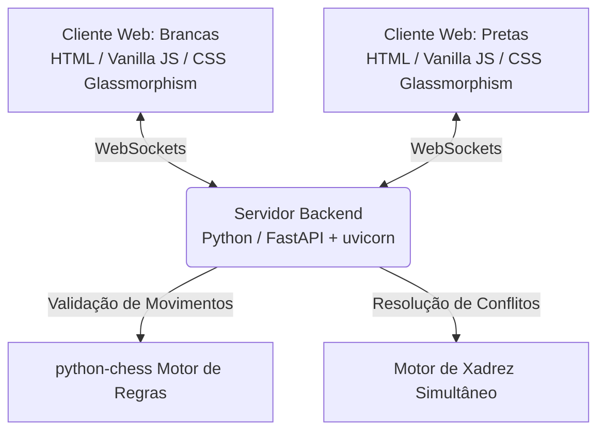

# ♟️⚡ Xadrez Quântico & Simultâneo

Bem-vindo ao repositório do **Xadrez Quântico & Simultâneo**! Este projeto tem como objetivo desenvolver uma Web App interativa, moderna e de alto apelo visual (Web App Híbrida) para uma nova variante de xadrez onde a dinâmica de turnos tradicional é reinventada.

---

## 🌌 O Conceito Fundamental: Jogadas Simultâneas

No xadrez clássico, os jogadores esperam passivamente o turno do adversário. Aqui, **o jogo acontece em tempo real e em sincronia**:

1. **Cronômetro de Rodada:** Cada rodada possui um tempo definido (ex: 15 a 30 segundos).
2. **Submissão Secreta:** Durante a rodada, **ambos os jogadores** analisam o tabuleiro e escolhem sua jogada secretamente. O oponente sabe apenas que você já tomou uma decisão ("Jogada Submetida ✅"), mas não sabe qual peça foi movida.
3. **Resolução Simultânea:** Assim que ambos submetem suas jogadas (ou o tempo do cronômetro se esgota), as jogadas são reveladas e executadas ao mesmo tempo no tabuleiro!

---

## 🏗️ Arquitetura do Projeto

O projeto é estruturado como uma **Web App Híbrida**:

* **Backend (Python / FastAPI):** Gerenciador de salas em tempo real, controle de cronômetro, processamento de WebSockets e resolução de conflitos quando duas jogadas se cruzam ou colidem.
* **Frontend (Vanilla HTML/CSS/JS):** Interface web com visual *Premium* (Dark Mode, gradientes luminosos, animações de colisão, tabuleiro responsivo e som interativo). Não requer instalação, abrindo diretamente em qualquer navegador desktop ou mobile.

---

## ⚔️ Mecânicas e Regras em Discussão

Como as jogadas acontecem exatamente no mesmo instante, surgem situações inéditas que exigem regras inovadoras de resolução de conflitos. 

📄 **Para ver a discussão detalhada das regras de colisão, captura do Rei e esquivas, consulte o documento:**
👉 **[Documentação de Regras e Mecânicas (doc/regras_e_mecanicas.md)](file:///c:/Users/User/Desktop/Python/Xadrez_qu%C3%A2ntico/doc/regras_e_mecanicas.md)**

---

## 💬 Como Contribuir e Discutir Ideias

Este repositório foi criado para facilitar o alinhamento de ideias e o design das mecânicas entre os criadores e colaboradores.

* **Discussão de Regras:** Utilize as **Issues** do GitHub ou edite o documento em `doc/regras_e_mecanicas.md` via Pull Request para sugerirmos melhorias nas regras de colisão ou novas ideias quânticas!
* **Arquitetura:** Veja o arquivo `consideracoes_iniciais.md` para um comparativo detalhado com o ecossistema do Lichess.

---
*Desenvolvido em Python & Web Stack Moderna.*
